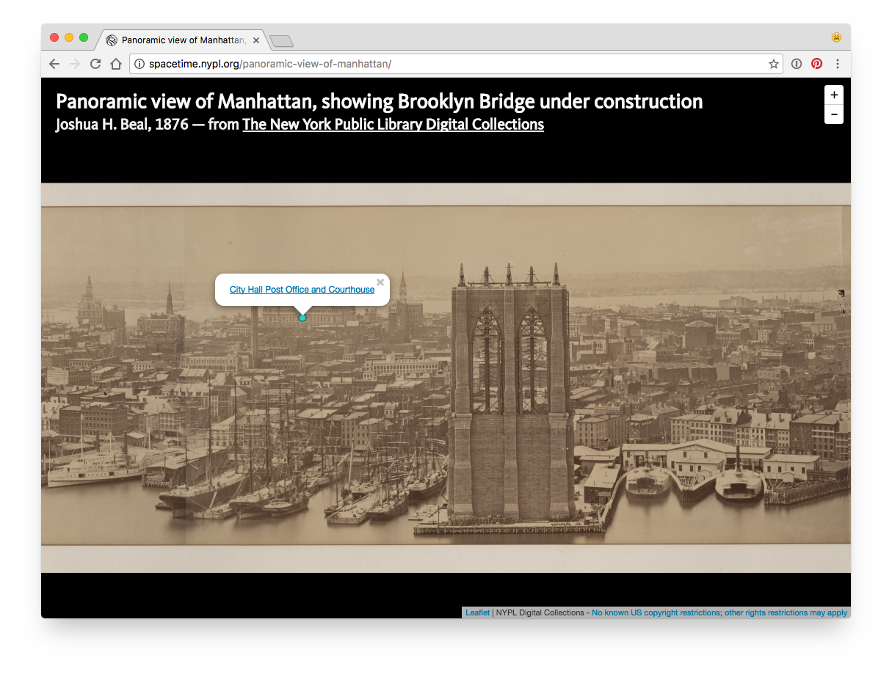

#  Panoramic view of Manhattan, showing Brooklyn Bridge under construction

Photographer: Joshua H. Beal, 1876

Zoomable viewer, shows photo from [The New York Public Library Digital Collections](http://digitalcollections.nypl.org/items/bceb5a80-d567-0131-e064-58d385a7bbd0). Made with [Leaflet](http://leafletjs.com/).

This repository also contains the [high-res photo](nypl-panoramic-view-of-manhattan.jpg) (35698 × 4254 pixels).

[](nypl-spacetime.github.io/panoramic-view-of-manhattan)

## Places

See [`places.json`](places.json) for the list of clickable places that are displayed on top of the panoramic photo.

To contribute to `places.json`, open your browser's inspector pane, click on the place on the photo where you want to add a marker, copy the GeoJSON Feature from the inspector's console, add the name and URL of the place you want to add, and submit a pull request.


__Note: the coordinates in `places.json` are not actual latitude, longitude coordinates, just translated pixel coordinates. They have no meaning on an actual map.__

## Camera position and field of view

The photo was taken from the Brooklyn tower of the Brooklyn Bridge. The location where the photo was taken (and the field of view of the photo) will be used in NYPL Labs' [Space/Time Directory Project](http://spacetime.nypl.org/):

```json
{
  "type": "FeatureCollection",
  "features": [
    {
      "type": "Feature",
      "properties": {
          "uuid": "bceb5a80-d567-0131-e064-58d385a7bbd0"
        },
      "geometry": {
        "type": "GeometryCollection",
        "geometries": [
          {
            "type": "Point",
            "coordinates": [
              -73.99431467056274,
              40.70411514363932
            ]
          },
          {
            "type": "LineString",
            "coordinates": [
              [
                -74.01974201202393,
                40.70575806946678
              ],
              [
                -73.99369239807129,
                40.72247782080547
              ]
            ]
          }
        ]
      }
    }
  ]
}
```
